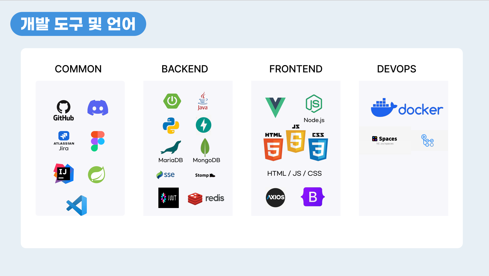
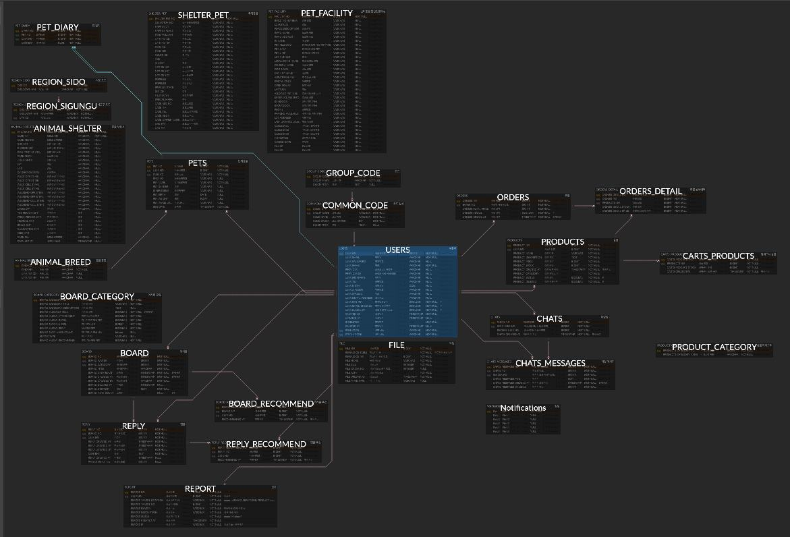

# 🐾 PetTact
> Pet + Tact: 반려동물과의 연결, 그리고 소통을 위한 통합 플랫폼

<p align="center">
  
</p>

<br>

## 📋 프로젝트 소개

반려동물 1500만 시대, 매년 10만 마리 이상 발생하는 유기동물 문제를 해결하고자
분산된 보호소 정보를 한 곳에서 조회할 수 있는 통합 플랫폼을 개발했습니다.

| 기능 | 설명 |
|------|------|
| 유기동물 & 보호소 조회 | 공공데이터 API 기반 전국 유기동물 및 보호소 정보 통합 조회 |
| 반려동물 관리 | 내 반려동물 등록 및 케어, AI 일기 & 챗봇, 동반시설 조회 |
| 커뮤니티 | 동적 게시판 생성 및 소통 기능 |
| 쇼핑몰 | 반려동물 용품 구매 및 장바구니 |
| 실시간 채팅 | SSE 기반 실시간 채팅 시스템 |

<br>

## 📅 프로젝트 정보

| 항목 | 내용 |
|------|------|
| 개발 기간 | 2025.06.11 ~ 2025.07.23 (6주) |
| 팀 구성 | 4인 (Full Stack 개발) |
| 수상 | 🏆 KOSA MSA기반 Full Stack 개발자 양성과정 최종 프로젝트 대상 |
| 배포 상태 | 배포 종료 ~~www.pettact.site~~ |

<br>

## 🙋 담당 파트

> 쇼핑몰 도메인 **(Product / Cart / Order) 전담 설계 및 구현**

### 💻 Backend — Spring Boot

**상품 (Product)**
- 카테고리, 키워드, 정렬 조건을 조합한 동적 상품 조회 API 개발
- 판매자 신청 기반 오픈마켓 구조 설계

**장바구니 (Cart)**
- 사용자 인증 기반 장바구니 CRUD 구현
- 중복 상품 추가 방지 로직 적용
- 수량 변경 및 선택 삭제 처리

**주문 / 결제 (Order)**
- 장바구니 데이터 기반 주문 생성 및 상태 관리 구현
- 토스페이먼츠 API 연동으로 결제 처리까지 구현
- 관리자 페이지 주문 내역 조회 기능 확장

**설계**
- 클라이언트–서버 간 요청 흐름 Sequence Diagram 문서화

### 🖥️ Frontend — Vue.js

- 상품 목록 페이지 UI 구현 (카테고리 필터, 검색, 정렬)
- 장바구니 페이지 구현 (수량 조절, 삭제, 합계 계산)
- 주문 및 결제 흐름 화면 구현

<br>

## 🛠️ 기술 스택

<p align="center">
  
</p>


<br>

## 🏗️ ERD 설계 (쇼핑몰 관련 주요 테이블)

<p align="center">
  
</p>

```
USERS ↔ PRODUCT  : 판매자-상품 관계
USERS ↔ CART     : 사용자별 장바구니
CART  ↔ ORDER    : 장바구니 → 주문 전환 흐름
ORDER ↔ PAYMENT  : 주문-결제 연결
```

<br>

## ✨ 구현하면서 신경 쓴 부분

쇼핑몰 파트를 혼자 전담하다 보니 프론트와 백엔드 흐름을 동시에 고려해야 했습니다.
특히 장바구니 → 주문 → 결제로 이어지는 흐름에서 상태 불일치가 생기지 않도록 설계하는 데 가장 많이 고민했습니다.
토스페이먼츠는 처음 써보는 외부 결제 API였는데, 공식 문서를 보며 직접 연동까지 완료한 경험이 가장 기억에 남습니다.